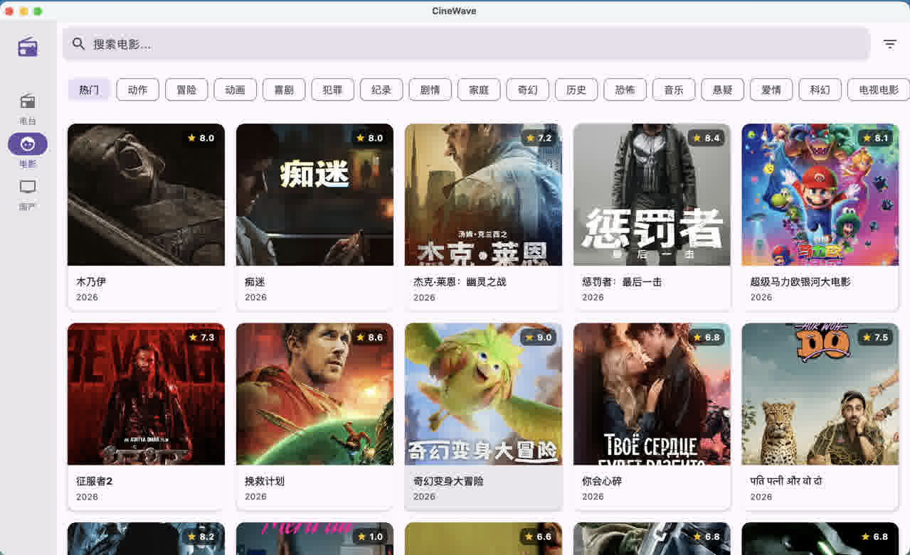
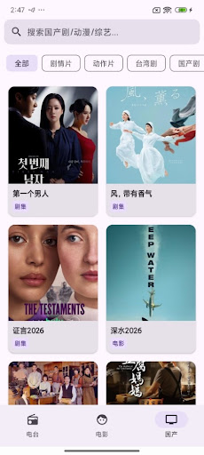

# CineWave

基于 Kotlin Multiplatform (KMP) + Compose Multiplatform 的跨平台影音播放应用，覆盖电影浏览、国内影视资源聚合、电台直播三大板块。

## 截图

| Desktop (macOS) | Mobile (Android) |
|:---:|:---:|
|  |  |

## 平台支持

| 平台 | 状态 | 说明 |
|------|------|------|
| Android | ✅ 可用 | 支持视频播放、电台直播、后台播放 |
| Desktop (macOS) | ✅ 可用 | 基于 VLCJ (libvlc) 的视频播放 |
| Desktop (Windows) | ⚠️ 未验证 | 代码层面支持，CI 可构建安装包 |
| iOS | ❌ 待开发 | 暂未实现 |

## 技术栈

- **Kotlin Multiplatform** — 跨平台业务逻辑共享
- **Compose Multiplatform** — 跨平台声明式 UI
- **Koin** — 依赖注入
- **Ktor** — HTTP 客户端
- **Room** — 本地数据库（Android）
- **Coil 3** — 图片加载
- **VLCJ (libvlc)** — Desktop 端视频播放
- **Media3 (ExoPlayer)** — Android 端视频/音频播放
- **Cash App Paging** — 分页加载

## 功能模块

### 🎬 电影板块 (TMDB)
- 热门电影列表、分类筛选、搜索
- 电影详情（演员、评分、简介）
- 多视频源嗅探播放

### 📺 国内影视板块
- 基于资源站 API 的影视数据聚合
- 站点配置通过 `db.json` 动态管理
- 视频源嗅探与播放

### 📻 电台直播
- 全球电台搜索与收听
- 后台播放支持（Android）

## 项目结构

```
CineWave/
├── shared/                          # 跨平台共享代码
│   └── src/
│       ├── commonMain/              # 各平台通用代码
│       │   ├── kotlin/              # 业务逻辑、UI、数据层
│       │   └── composeResources/    # 跨平台资源文件
│       │       └── files/           # 运行时文件资源
│       │           ├── db.json              # 站点配置（已 gitignore）
│       │           ├── tmdb_api_key.txt     # TMDB API Key（已 gitignore）
│       │           ├── sensitive_words.txt  # 敏感词过滤表
│       │           └── my_kmp_icon.png      # 应用图标
│       ├── androidMain/             # Android 平台实现
│       ├── jvmMain/                 # Desktop (JVM) 平台实现
│       └── iosMain/                 # iOS 平台实现（待完善）
├── androidApp/                      # Android 应用入口
├── desktopApp/                      # Desktop 应用入口
└── iosApp/                          # iOS 应用入口（待完善）
```

## 快速开始

### 前置条件

- JDK 11+
- Android Studio (Android 开发)
- Xcode (iOS 开发，暂未实现)

### 1. 配置必要文件

项目依赖两个运行时配置文件，它们已被 `.gitignore` 排除，需手动创建：

#### `shared/src/commonMain/composeResources/files/db.json`

影视资源站点的配置数据，Base64 编码的 JSON 文件。内容格式参考 CI 中的 `DB_JSON` Secret：

```bash
# 从 CI Secret 获取或自行准备
echo "<base64_encoded_json>" | base64 -d > shared/src/commonMain/composeResources/files/db.json
```

#### `shared/src/commonMain/composeResources/files/tmdb_api_key.txt`

TMDB API 密钥，纯文本文件：

```bash
echo "your_tmdb_api_key_here" > shared/src/commonMain/composeResources/files/tmdb_api_key.txt
```

> 这两个文件通过 `Res.readBytes("files/...")` 在运行时读取，与平台无关。CI 环境中由 GitHub Secrets 自动注入。

### 2. 运行

#### Android

```bash
./gradlew :androidApp:assembleDebug
```

#### Desktop (macOS)

```bash
# 安装 VLC 依赖
brew install vlc

# 标准运行
./gradlew :desktopApp:run

# 热重载开发
./gradlew :desktopApp:hotRun --auto
```

#### Desktop (Windows)

```bash
# 安装 VLC
choco install vlc

# 构建可分发版本
./gradlew :desktopApp:createDistributable
```

### 视频播放

- **Android**：基于 Media3 (ExoPlayer)，支持本地缓存代理
- **Desktop**：基于 VLCJ (libvlc)，支持本地缓存代理
- 视频源通过嗅探引擎从目标页面提取真实播放地址

## 许可证

[Apache License 2.0](LICENSE)
